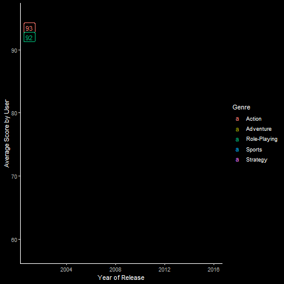
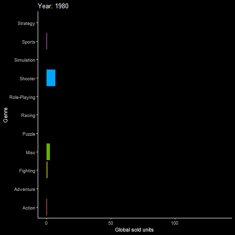
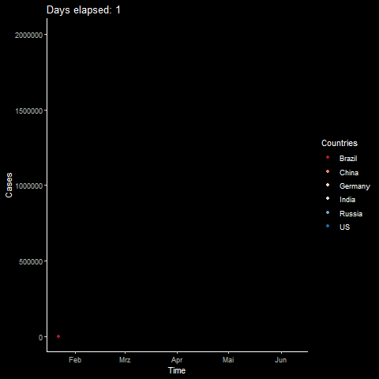

# statsmotions-Animations



```{r}
ggplot(cdata,aes(x=Year_of_Release,y=AverageScore,col=Genre))+
         geom_line()+
        dark_theme_classic()+
         geom_label(label=substr(as.character(cdata$AverageScore),1,2),label.size = 0.25)+
        transition_reveal(Year_of_Release)+
  xlab("Year of Release")+
  ylab("Average Score by User")

```

```{r}
ggplot(orderdsumdata,aes(x=Genre,y=Total,fill=Genre))+
  geom_bar(stat="identity")+
  dark_theme_classic()+
  coord_flip()+
  ylab("Global sold units")+
  theme(legend.position = "none")+
  transition_time(Year_of_Release) +
  labs(title = "Year: {round(frame_time)}")+
  shadow_mark(size = 1.5)
```


```{r}
ggplot(data = long_data, aes(x=Time, y=Cases)) +
  geom_point(aes(colour=Countries),size=1.5)+
  dark_theme_classic()+
  scale_color_brewer(palette="RdBu")+
  transition_time(days) +
  labs(title = "Days ela: {round(frame_time)}")+
  shadow_mark(size = 1.5)
```
